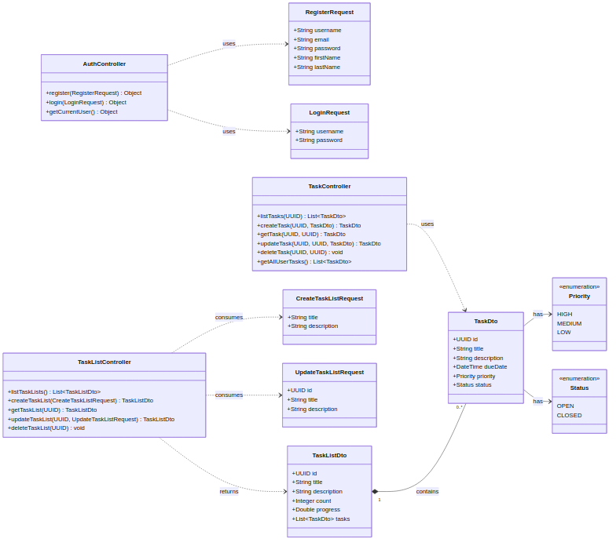

# Task Tracker

A full-stack task management application with built with Spring Boot and React.

## Features

- **User Authentication**: JWT-based login and registration
- **Task Lists**: Create, edit, delete, and manage task lists
- **Task Management**: Add, edit, delete, and track tasks with priorities and due dates
- **Dark Mode**: Toggle between light and dark themes
- **Responsive Design**: Works on desktop and mobile devices

## Quick Start

### Backend (Spring Boot)
```bash
# Run the backend API
./mvnw spring-boot:run
```
The API will be available at `http://localhost:8080`

### Frontend (React)
Repo link: https://github.com/avionmission/tasks

```bash
# Navigate to frontend directory
git clone https://github.com/avionmission/tasks
cd tasks

# Install dependencies
npm install

# Start development server
npm run dev
```
The frontend will be available at `http://localhost:5173`

## API Documentation

Swagger UI is available at: `http://localhost:8080/swagger-ui.html`

## Architecture

The application follows a layered architecture pattern with clear separation of concerns:



### Backend Architecture (Spring Boot)
- **Controllers**: Handle HTTP requests and responses
- **Services**: Business logic and transaction management
- **Repositories**: Data access layer using Spring Data JPA
- **Entities**: Domain models representing database tables
- **Security**: JWT authentication and authorization
- **Configuration**: Swagger documentation and security setup

### Frontend Architecture (React)
- **Pages**: Main application views (Dashboard, Login, Register, Task Details)
- **Components**: Reusable UI components (Layout, Modals, Cards)
- **Context**: Global state management (Auth, Theme)
- **Services**: API communication layer
- **Routing**: Client-side navigation with React Router

## Tech Stack

**Backend:**
- Spring Boot 3.x
- Spring Security
- Spring Data JPA
- JWT Authentication
- H2 Database (development)
- Swagger/OpenAPI

**Frontend:**
- React 19
- React Router
- Axios
- Tailwind CSS
- Lucide React Icons